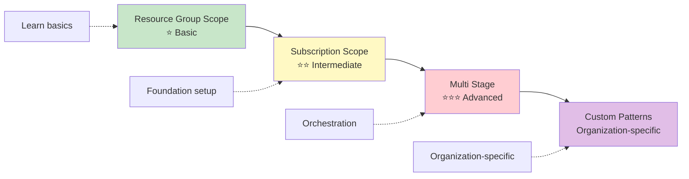
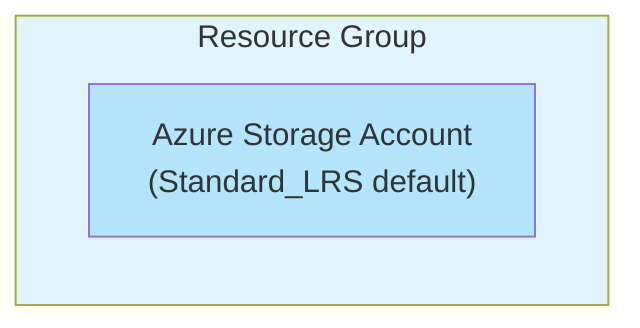
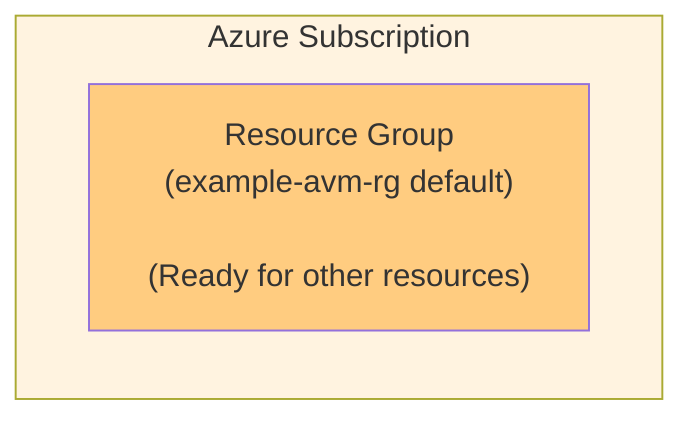
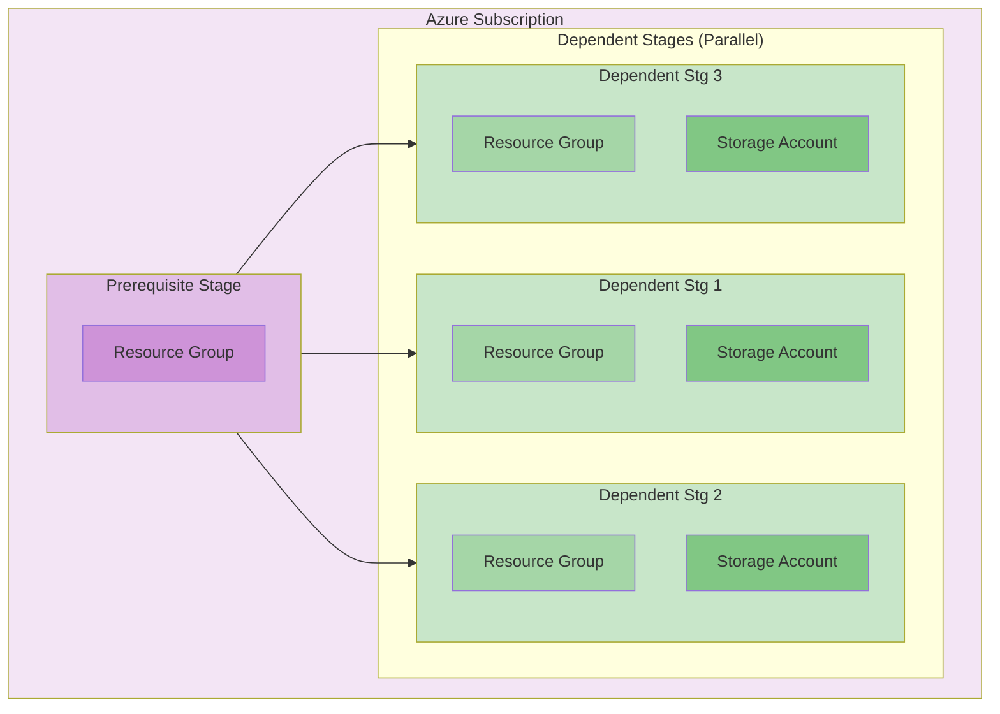

# Workload Patterns Overview

This document provides a comprehensive overview of all available workload patterns in the Release Engine framework. Each pattern represents a different level of complexity and addresses specific deployment scenarios.

## Pattern Catalog

### 1. Resource Group Scope Pattern ⭐ Basic
**File**: `/patterns/resource_group_scope_pattern/`
**Complexity**: Basic
**Deployment Scope**: Resource Group

A foundational pattern that demonstrates the simplest deployment scenario - a single Azure Storage Account using Azure Verified Modules (AVM).

- **Use Case**: Learning the framework, simple resource deployments
- **Resources**: 1 Storage Account
- **Stages**: 1 (single deployment stage)
- **Dependencies**: None
- **Best For**: New teams, proof of concepts, standalone storage needs

### 2. Subscription Scope Pattern ⭐⭐ Intermediate  
**File**: `/patterns/subscription_scope_pattern/`
**Complexity**: Intermediate
**Deployment Scope**: Subscription

Demonstrates subscription-level resource deployment, creating Resource Groups that serve as foundations for other resources.

- **Use Case**: Infrastructure foundations, resource group creation
- **Resources**: 1 Resource Group
- **Stages**: 1 (subscription-level deployment)
- **Dependencies**: None
- **Best For**: Platform setup, environment preparation, governance foundations

### 3. Multi Stage Pattern ⭐⭐⭐ Advanced
**File**: `/patterns/multi_stage_pattern/`
**Complexity**: Advanced  
**Deployment Scope**: Subscription

The most sophisticated pattern showcasing complex, multi-stage deployments with dependencies and parallel execution.

- **Use Case**: Complex applications, enterprise deployments, orchestrated infrastructure
- **Resources**: 1 Resource Group (prerequisite) + 3x (Resource Group + Storage Account)
- **Stages**: 4 (1 prerequisite + 3 dependent parallel stages)
- **Dependencies**: Complex dependency management between stages
- **Best For**: Enterprise applications, complex infrastructure, team learning advanced concepts

## Pattern Comparison Matrix

| Feature | Resource Group Scope | Subscription Scope | Multi Stage |
|---------|---------------------|-------------------|-------------|
| **Complexity** | ⭐ Basic | ⭐⭐ Intermediate | ⭐⭐⭐ Advanced |
| **Resources** | 1 | 1 | 7 |
| **Bicep Files** | 1 | 1 | 2 |
| **Parameter Files** | 1 | 1 | 4 |
| **Deployment Stages** | 1 | 1 | 4 |
| **Dependencies** | None | None | Complex |
| **Parallel Execution** | N/A | N/A | ✅ |
| **Learning Value** | Fundamentals | Scoping | Orchestration |
| **Production Ready** | ✅ | ✅ | ✅ |

## Pattern Selection Guide

### Choose Resource Group Scope Pattern When:
- ✅ Learning the Release Engine framework
- ✅ Deploying standalone resources
- ✅ Simple storage or compute needs
- ✅ Proof of concept projects
- ✅ Quick wins and demonstrations

### Choose Subscription Scope Pattern When:
- ✅ Setting up environment foundations
- ✅ Creating resource groups for other patterns
- ✅ Implementing governance structures
- ✅ Preparing subscription-level resources
- ✅ Platform team initialization

### Choose Multi Stage Pattern When:
- ✅ Complex application deployments
- ✅ Multiple interdependent resources
- ✅ Learning advanced orchestration
- ✅ Enterprise-grade deployments
- ✅ Performance optimization needs

## Pattern Evolution Path

Teams typically progress through patterns as their needs and expertise grow:



### Learning Progression
1. **Start with Resource Group Scope**: Understand basic concepts, AVM usage, parameter files
2. **Graduate to Subscription Scope**: Learn subscription-level permissions, resource group creation
3. **Master Multi Stage**: Complex dependencies, parallel execution, advanced orchestration
4. **Create Custom Patterns**: Organization-specific patterns based on learned concepts

## Technical Architecture Comparison

### Resource Group Scope Pattern Architecture


### Subscription Scope Pattern Architecture


### Multi Stage Pattern Architecture


## Configuration Complexity Comparison

### Parameter Files Required
- **Resource Group Scope**: 1 parameter file (`resource_group_scope_pattern.parameters.json`)
- **Subscription Scope**: 1 parameter file (`subscription_scope_pattern.parameters.json`)  
- **Multi Stage**: 4 parameter files (prerequisite + 3 dependent stages)

### Environment Variables Complexity
- **Resource Group Scope**: Basic (location, naming)
- **Subscription Scope**: Intermediate (tagging, governance)
- **Multi Stage**: Advanced (unique naming per stage, complex tagging)

### Pipeline Configuration Lines
- **Resource Group Scope**: ~40+ lines of YAML (with debug stage)
- **Subscription Scope**: ~40+ lines of YAML (with debug stage)
- **Multi Stage**: ~80+ lines of YAML (with debug stage)

## Common Use Case Mapping

### Resource Group Scope Pattern Use Cases
- **Development Storage**: Personal or team development storage needs
- **Backup Solutions**: Simple backup storage accounts
- **Static Website Storage**: Storage for static website hosting
- **Log Storage**: Dedicated storage for application logs
- **Archive Storage**: Cold storage for long-term retention

### Subscription Scope Pattern Use Cases
- **Environment Setup**: Creating dev/test/prod resource groups
- **Cost Center Boundaries**: Resource groups for different departments
- **Application Boundaries**: Separate resource groups per application
- **Compliance Boundaries**: Resource groups for different compliance requirements
- **Team Boundaries**: Resource groups for different development teams

### Multi Stage Pattern Use Cases
- **E-commerce Platforms**: Database → API → Frontend → CDN deployments
- **Data Analytics Platforms**: Storage → Processing → Analytics → Reporting
- **Microservices Architectures**: Foundation → Services → Gateway → Monitoring
- **IoT Solutions**: Device Management → Data Ingestion → Processing → Visualization
- **ML Platforms**: Data Storage → Model Training → Model Serving → Monitoring

## Performance Characteristics

### Deployment Time Comparison
| Pattern | Typical Deployment Time | Parallel Stages | Bottlenecks |
|---------|------------------------|----------------|-------------|
| Single Resource | 2-3 minutes | 1 | Storage account creation |
| Subscription Scope | 1-2 minutes | 1 | Resource group creation |
| Multi Stage | 8-12 minutes | 3 dependent | Prerequisite stage completion |

### Resource Provisioning Speed
- **Single Resource**: Fastest (1 resource)
- **Subscription Scope**: Very Fast (lightweight resource group)
- **Multi Stage**: Moderate (7 resources, but 3 stages in parallel)

## Cost Implications

### Resource Costs
- **Single Resource**: 1 storage account (~$1-10/month depending on usage)
- **Subscription Scope**: Resource group (no direct cost)
- **Multi Stage**: 4 storage accounts + 4 resource groups (~$4-40/month)

### Deployment Costs
- **Azure DevOps Pipeline Minutes**: Multi Stage consumes more pipeline minutes
- **Resource Group Limits**: Multi Stage uses more resource groups per subscription
- **Monitoring Costs**: More resources = more monitoring data

## Security Considerations by Pattern

### Permission Requirements
- **Single Resource**: Resource Group Contributor
- **Subscription Scope**: Subscription Contributor  
- **Multi Stage**: Subscription Contributor (highest privileges)

### Security Best Practices
- **All Patterns**: Use Azure Verified Modules for security baseline
- **Single Resource**: Minimal attack surface
- **Subscription Scope**: Foundation for RBAC implementation
- **Multi Stage**: Complex security due to multiple resources and stages

### Compliance Implications
- **Single Resource**: Simple compliance boundary
- **Subscription Scope**: Compliance foundation setup
- **Multi Stage**: Complex compliance across multiple stages and resources

## Pattern Extension Guidelines

### Extending Single Resource Pattern
```yaml
# Add more resources to single stage
module keyVault 'br/public:avm/res/key-vault/vault:0.4.0' = {
  name: 'keyVaultDeployment'
  params: {
    name: keyVaultName
    location: resourceLocation
  }
}
```

### Extending Subscription Scope Pattern
```yaml
# Add multiple resource groups
module appResourceGroup 'br/public:avm/res/resources/resource-group:0.4.2' = {
  name: 'appResourceGroupDeployment'
  params: {
    name: appResourceGroupName
  }
}

module dataResourceGroup 'br/public:avm/res/resources/resource-group:0.4.2' = {
  name: 'dataResourceGroupDeployment'  
  params: {
    name: dataResourceGroupName
  }
}
```

### Extending Multi Stage Pattern
```yaml
# Add additional dependent stages
- infrastructure:
    iac:
      name: dependent_stage4
      displayName: Dependent Stg 4
      deploymentScope: Subscription
      serviceConnection: $(serviceConnection)
      iacMainFileName: multi_stage_pattern.dependent.bicep
      iacParameterFileName: /parameters/multi_stage_pattern.dependent4.parameters.json
      dependsOn: prerequisite_stage
      lastInStage: true
```

## Documentation Links

### Pattern-Specific Documentation
- [Single Resource Pattern README](./single_resource_pattern/README.md)
- [Subscription Scope Pattern README](./subscription_scope_pattern/README.md)
- [Multi Stage Pattern README](./multi_stage_pattern/README.md)

### Related Documentation
- [Release Engine Architecture](https://github.com/thecloudexplorers/release-engine/blob/main/docs/Release-Engine-Solution-Architecture.md)
- [Configuration Repository Template](https://github.com/thecloudexplorers/release-engine-config-template)
- [Azure Verified Modules](https://github.com/Azure/bicep-registry-modules)

## Pattern Development Guidelines

### Creating New Patterns
When creating new patterns based on these examples:

1. **Start with Single Resource**: Use as template for simple scenarios
2. **Use Subscription Scope**: As foundation for resource group creation patterns  
3. **Model after Multi Stage**: For complex orchestration scenarios
4. **Follow Naming Conventions**: Consistent with existing patterns
5. **Document Thoroughly**: Include comprehensive README files
6. **Test Extensively**: Validate across all environments

### Pattern Naming Conventions
- Use descriptive names: `webapp_with_database`, `function_app_premium`
- Include complexity indicator: `_basic`, `_advanced`
- Include scope indicator: `_subscription`, `_resource_group`
- Use underscores for separation

### Pattern Quality Gates
- ✅ **Bicep Validation**: Templates must compile without errors
- ✅ **AVM Priority**: Use Azure Verified Modules when available
- ✅ **Parameter Documentation**: All parameters must be documented
- ✅ **Output Documentation**: All outputs must be documented  
- ✅ **README Completeness**: Comprehensive documentation required
- ✅ **Testing Evidence**: Deployment testing in multiple environments

---

*This overview provides guidance for selecting, using, and extending the Release Engine workload patterns. Start simple and progress to more complex patterns as your team's needs and expertise grow.*