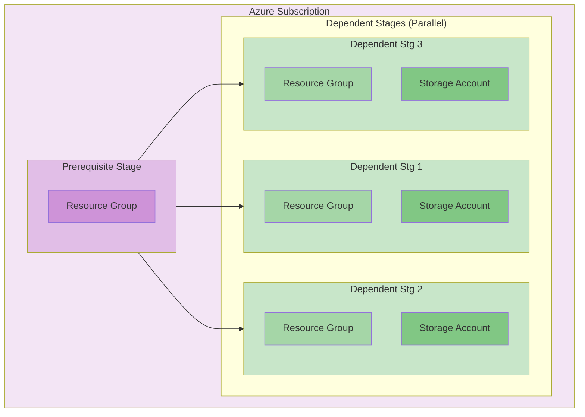

# Multi Stage Pattern

## Overview

The Multi Stage Pattern demonstrates the most sophisticated deployment capability in the Release Engine framework. It orchestrates complex, multi-stage deployments with dependencies between stages, allowing for advanced scenarios like prerequisite infrastructure, followed by multiple dependent deployments that can run in parallel or sequence.

## Architecture

This pattern showcases a complex deployment topology with one prerequisite stage and three dependent stages that all depend on the prerequisite stage.



## Pipeline Visualization

The following image shows the actual Azure DevOps pipeline execution with the multi-stage deployment pattern:


*Pipeline stages showing Build phases, followed by Development environment (Prerequisite + 3 Dependent stages), Test environment (Prerequisite + 3 Dependent stages), and Production environment (Prerequisite + 3 Dependent stages)*

## Prerequisites

- **Azure Permissions**: Owner or Contributor access at subscription level
- **Service Principal**: Configured with subscription-level permissions for resource group and storage account creation
- **Multiple Parameter Files**: Separate parameter files for prerequisite and each dependent stage
- **Complex Configuration**: Understanding of stage dependencies and orchestration

## Resources Created

### Prerequisite Stage
- **Azure Resource Group** (AVM: `avm/res/resources/resource-group:0.4.2`)
  - Foundation resource group for dependent resources
  - Deployed once per environment

### Dependent Stages (1, 2, 3)
Each dependent stage creates:
- **Azure Resource Group** (AVM: `avm/res/resources/resource-group:0.4.2`)
- **Azure Storage Account** (AVM: `avm/res/storage/storage-account:0.27.1`)
  - Deployed in parallel after prerequisite completion
  - Each with unique configurations via separate parameter files

## Parameters

### Prerequisite Stage Parameters
| Parameter | Type | Description | Default | Required |
|-----------|------|-------------|---------|----------|
| `tags` | object | Tags for the resource group | `{}` | No |
| `resourceGroupName` | string | Name of the prerequisite resource group | `example-storage-rg` | No |

### Dependent Stage Parameters
| Parameter | Type | Description | Default | Required |
|-----------|------|-------------|---------|----------|
| `resourceLocation` | string | Azure region for deployment | None | Yes |
| `tags` | object | Tags for resources | `{}` | No |
| `resourceGroupName` | string | Name of the resource group | `example-storage-rg` | No |
| `storageAccountName` | string | Name of the storage account | None | Yes |

### Parameter Constraints
- **`resourceLocation`**: Must be one of: `westeurope`, `uksouth`
- **`storageAccountName`**: Must be globally unique across all Azure storage accounts
- **`resourceGroupName`**: Must follow Azure naming conventions

## Outputs

### Prerequisite Stage
| Output | Type | Description |
|--------|------|-------------|
| `resourceGroupId` | string | Resource ID of the prerequisite resource group |

### Dependent Stages
| Output | Type | Description |
|--------|------|-------------|
| `resourceGroupId` | string | Resource ID of the stage-specific resource group |
| `storageAccountId` | string | Resource ID of the created storage account |

## Deployment Scope

- **Target Scope**: Subscription (all stages)
- **Service Connection Required**: Yes (subscription-level permissions)
- **Multi-Stage**: Yes (prerequisite + 3 dependent stages)
- **Parallel Execution**: Dependent stages run in parallel after prerequisite

## Pipeline Configuration

### Complete Stage Configuration

```yaml
stages:
  - template: /common/pipelines/01-orchestrators/alz.devops.workload.orchestrator.yml@release-engine-core
    parameters:
      workloadSettings:
        name: multi_stage_pattern
        configurationFilePath: ${{ parameters.platformWorkloadSettings.configurationFilePath }}
        environments: ${{ parameters.platformWorkloadSettings.environments }}
        workloadArtifactsPath: /patterns/multi_stage_pattern
        stages:
          # Prerequisite Stage - Runs First
          - infrastructure:
              iac:
                name: prerequisite_stage
                displayName: Prerequisite Stage
                deploymentScope: Subscription
                serviceConnection: $(serviceConnection)
                iacMainFileName: multi_stage_pattern.prerequisite.bicep
                iacParameterFileName: /parameters/multi_stage_pattern.prerequisite.parameters.json

          # Dependent Stage 1 - Depends on Prerequisite
          - infrastructure:
              iac:
                name: dependent_stage1
                displayName: Dependent Stg 1
                deploymentScope: Subscription
                serviceConnection: $(serviceConnection)
                iacMainFileName: multi_stage_pattern.dependent.bicep
                iacParameterFileName: /parameters/multi_stage_pattern.dependent1.parameters.json
                dependsOn: prerequisite_stage
                lastInStage: true

          # Dependent Stage 2 - Depends on Prerequisite (Parallel with Stage 1 & 3)
          - infrastructure:
              iac:
                name: dependent_stage2
                displayName: Dependent Stg 2
                deploymentScope: Subscription
                serviceConnection: $(serviceConnection)
                iacMainFileName: multi_stage_pattern.dependent.bicep
                iacParameterFileName: /parameters/multi_stage_pattern.dependent2.parameters.json
                dependsOn: prerequisite_stage
                lastInStage: true

          # Dependent Stage 3 - Depends on Prerequisite (Parallel with Stage 1 & 2)
          - infrastructure:
              iac:
                name: dependent_stage3
                displayName: Dependent Stg 3
                deploymentScope: Subscription
                serviceConnection: $(serviceConnection)
                iacMainFileName: multi_stage_pattern.dependent.bicep
                iacParameterFileName: /parameters/multi_stage_pattern.dependent3.parameters.json
                dependsOn: prerequisite_stage
                lastInStage: true
```

### Key Configuration Points

- **Dependency Management**: All dependent stages depend on `prerequisite_stage`
- **Parallel Execution**: Stages 1, 2, and 3 run in parallel after prerequisite completion
- **Multiple Bicep Files**: Separate templates for prerequisite and dependent resources
- **Parameter File Mapping**: Each stage uses its own parameter file for customization

## Configuration Repository Integration

### Parameter Files Required

The pattern requires four separate parameter files:

1. `multi_stage_pattern.prerequisite.parameters.json`
2. `multi_stage_pattern.dependent1.parameters.json`
3. `multi_stage_pattern.dependent2.parameters.json`
4. `multi_stage_pattern.dependent3.parameters.json`

### Prerequisite Stage Parameter File

```json
{
  "$schema": "https://schema.management.azure.com/schemas/2019-04-01/deploymentParameters.json#",
  "contentVersion": "1.0.0.0",
  "parameters": {
    "resourceGroupName": {
      "value": "rg-#{applicationName}#-prerequisite-#{environmentAbbreviation}#"
    },
    "tags": {
      "value": {
        "Environment": "#{environmentAbbreviation}#",
        "Stage": "Prerequisite",
        "Application": "#{applicationName}#",
        "Owner": "#{primary_owner}#"
      }
    }
  }
}
```

### Dependent Stage Parameter Files

```json
{
  "$schema": "https://schema.management.azure.com/schemas/2019-04-01/deploymentParameters.json#",
  "contentVersion": "1.0.0.0",
  "parameters": {
    "resourceLocation": {
      "value": "#{resourceLocation}#"
    },
    "resourceGroupName": {
      "value": "rg-#{applicationName}#-stage1-#{environmentAbbreviation}#"
    },
    "storageAccountName": {
      "value": "st#{applicationAbbreviation}#stg1#{environmentAbbreviation}##{uniqueString}#"
    },
    "tags": {
      "value": {
        "Environment": "#{environmentAbbreviation}#",
        "Stage": "Dependent-1",
        "Application": "#{applicationName}#",
        "Owner": "#{primary_owner}#"
      }
    }
  }
}
```

### Metadata Configuration

```yaml
# In _config/metadata.yml
variables:
  workload: "multi_stage_pattern"      # Must match pattern name
  applicationName: "myComplexApp"      # Used across all stages
  applicationAbbreviation: "mca"       # For unique naming
  primary_owner: "devops@company.com"  # Consistent tagging
```

## Environment Variables

### Development Environment

```yaml
# vars-development.yml
variables:
  environmentAbbreviation: dev
  resourceLocation: westeurope
  
  # Unique string for storage account naming
  uniqueString: "dev001"
  
  # Development-appropriate configurations
  enableAdvancedFeatures: false
  storageAccountSku: Standard_LRS
```

### Production Environment

```yaml
# vars-production.yml
variables:
  environmentAbbreviation: prd
  resourceLocation: westeurope
  
  # Unique string for storage account naming
  uniqueString: "prd001"
  
  # Production-grade configurations
  enableAdvancedFeatures: true
  storageAccountSku: Standard_GRS
```

## Usage Examples

### Complete Multi-Environment Deployment

The pipeline automatically promotes through environments:

1. **Development**: Prerequisite → 3 Parallel Dependent Stages
2. **Test**: Prerequisite → 3 Parallel Dependent Stages  
3. **Production**: Prerequisite → 3 Parallel Dependent Stages

### Customizing Stage Behavior

Each dependent stage can be customized via its parameter file:

- **Stage 1**: Primary application storage
- **Stage 2**: Backup and archival storage
- **Stage 3**: Analytics and reporting storage

## Advanced Scenarios

### Sequential Dependencies

To make dependent stages run sequentially instead of parallel:

```yaml
# Stage 2 depends on Stage 1
- infrastructure:
    iac:
      name: dependent_stage2
      dependsOn: dependent_stage1  # Sequential dependency
      
# Stage 3 depends on Stage 2
- infrastructure:
    iac:
      name: dependent_stage3
      dependsOn: dependent_stage2  # Chain dependencies
```

### Mixed Dependencies

Complex dependency chains:

```yaml
# Stage 2 depends on both prerequisite AND stage 1
- infrastructure:
    iac:
      name: dependent_stage2
      dependsOn: [prerequisite_stage, dependent_stage1]
```

### Conditional Stages

Using conditional deployment based on environment:

```yaml
# Only deploy stage 3 in production
- infrastructure:
    iac:
      name: dependent_stage3
      condition: eq(variables['environmentAbbreviation'], 'prd')
      dependsOn: prerequisite_stage
```

## Security Considerations

- **Subscription-Level Permissions**: Requires elevated permissions for resource group creation
- **Resource Isolation**: Each stage creates its own resource group for isolation
- **Consistent Tagging**: All resources tagged with stage information for tracking
- **Service Principal Security**: Single service principal used across all stages (consider stage-specific principals for enhanced security)

## Performance Optimization

### Parallel Execution Benefits
- **Reduced Deployment Time**: Dependent stages run simultaneously
- **Resource Efficiency**: Maximum utilization of Azure deployment capabilities
- **Faster Feedback**: Earlier detection of deployment issues

### Optimization Strategies
- **Template Optimization**: Minimize dependencies within Bicep templates
- **Parameter Validation**: Front-load parameter validation to fail fast
- **Resource Grouping**: Group related resources within stages for efficiency

## Cost Optimization

### Multi-Stage Cost Management
- **Stage-Specific Tagging**: Enable cost allocation by deployment stage
- **Environment Scaling**: Different configurations per environment
- **Resource Lifecycle**: Coordinate lifecycle management across stages

### Cost Allocation Strategy

```yaml
# Tag strategy for cost tracking
tags:
  Environment: "#{environmentAbbreviation}#"
  Stage: "dependent-1"  # Track costs by stage
  Application: "#{applicationName}#"
  CostCenter: "#{cost_center}#"
  DeploymentGroup: "multi-stage-#{Build.BuildNumber}#"
```

## Monitoring and Diagnostics

### Multi-Stage Monitoring Strategy

- **Stage-Level Monitoring**: Each stage independently monitored
- **Cross-Stage Dependencies**: Monitor dependency health between stages
- **Deployment Tracking**: Track deployment progress across all stages
- **Rollback Coordination**: Coordinate rollbacks across dependent stages

### Diagnostic Configuration

```yaml
# Enable diagnostics per stage
variables:
  enableDiagnostics: true
  logAnalyticsWorkspace: "law-#{applicationName}#-#{environmentAbbreviation}#"
  
  # Stage-specific diagnostic settings
  stage1DiagnosticsEnabled: "#{enableDiagnostics}#"
  stage2DiagnosticsEnabled: "#{enableDiagnostics}#"
  stage3DiagnosticsEnabled: "#{enableDiagnostics}#"
```

## Troubleshooting

### Common Multi-Stage Issues

#### Dependency Resolution Failures
**Problem**: Dependent stages fail because prerequisite stage outputs not available  
**Solution**: Ensure prerequisite stage completes successfully and outputs are properly defined

#### Parallel Execution Conflicts
**Problem**: Resource naming conflicts between parallel stages  
**Solution**: Use unique naming patterns in each stage's parameter file

#### Service Principal Permissions
**Problem**: Permissions insufficient for subscription-level operations  
**Solution**: Ensure service principal has Contributor role at subscription level

#### Parameter File Validation
**Problem**: One of the four parameter files has validation errors  
**Solution**: Validate each parameter file independently and ensure consistent token usage

### Debugging Strategies

#### Stage Isolation Testing
```yaml
# Test individual stages by commenting out others
stages:
  - infrastructure:
      iac:
        name: prerequisite_stage
        # ... prerequisite configuration
  
  # Comment out dependent stages for isolation testing
  # - infrastructure: ...
```

#### Dependency Visualization
Use the pipeline visualization to understand stage dependencies:
- Prerequisite stage shown as independent
- Dependent stages shown with arrows pointing from prerequisite
- Parallel execution clearly visible

### Validation Commands

```bash
# Validate prerequisite template
az bicep build --file multi_stage_pattern.prerequisite.bicep

# Validate dependent template
az bicep build --file multi_stage_pattern.dependent.bicep

# Test prerequisite deployment
az deployment sub what-if \
  --location westeurope \
  --template-file multi_stage_pattern.prerequisite.bicep \
  --parameters @multi_stage_pattern.prerequisite.parameters.json

# Test dependent deployment (requires existing resource group)
az deployment sub what-if \
  --location westeurope \
  --template-file multi_stage_pattern.dependent.bicep \
  --parameters @multi_stage_pattern.dependent1.parameters.json
```

## Pattern Evolution

### Graduating from Simpler Patterns
This pattern represents the evolution from:
- **Single Resource Pattern**: When you need multiple related deployments
- **Subscription Scope Pattern**: When you need complex dependencies
- **Simple Multi-Resource**: When you need orchestrated, multi-stage deployments

### Advanced Variations
Consider these enhancements:
- **Cross-Region Deployment**: Deploy stages across multiple Azure regions
- **Multi-Subscription**: Deploy stages across different subscriptions
- **Conditional Stages**: Environment-specific stage activation
- **Dynamic Stage Generation**: Generate stages based on configuration

## Use Cases

### Complex Application Platforms
- **Multi-Tier Applications**: Separate stages for database, API, frontend
- **Microservices Platforms**: Individual stages for each service
- **Data Platforms**: Separate stages for ingestion, processing, analytics

### Infrastructure Foundations
- **Network Foundation**: Hub network followed by spoke deployments
- **Security Foundation**: Security services followed by application resources
- **Monitoring Foundation**: Observability stack followed by application monitoring

### Migration Scenarios
- **Lift and Shift**: Infrastructure first, then application components
- **Modernization**: Legacy resources followed by cloud-native components
- **Hybrid Deployments**: On-premises integration followed by cloud resources

## Integration Patterns

### With Other Release Engine Patterns

#### As Foundation for Applications
```yaml
# Multi-stage as prerequisite for application deployment
stages:
  # Multi-stage infrastructure deployment
  - template: /patterns/multi_stage_pattern/workload.yml@workload
    
  # Application deployment using created infrastructure
  - template: /patterns/application_pattern/workload.yml@workload
    parameters:
      dependsOn: multi_stage_pattern_completion
```

#### Nested Multi-Stage Patterns
```yaml
# Multiple multi-stage patterns in sequence
stages:
  # Foundation multi-stage (networking, security)
  - template: /patterns/foundation_multi_stage/workload.yml@workload
    
  # Application multi-stage (databases, APIs, frontend)
  - template: /patterns/application_multi_stage/workload.yml@workload
    parameters:
      dependsOn: foundation_completion
```

## Maintenance and Updates

### Template Maintenance
- **AVM Updates**: Regularly update both prerequisite and dependent AVM modules
- **Parameter Evolution**: Add new parameters as requirements evolve
- **Output Enhancement**: Extend outputs as downstream dependencies require
- **Security Patches**: Apply security updates consistently across all stages

### Pipeline Maintenance
- **Dependency Review**: Regularly review and optimize stage dependencies
- **Performance Monitoring**: Monitor deployment times and optimize bottlenecks
- **Error Handling**: Enhance error handling and recovery mechanisms
- **Documentation Updates**: Keep stage documentation current with changes

### Configuration Maintenance
- **Parameter File Sync**: Ensure consistency across all four parameter files
- **Token Standardization**: Maintain consistent token usage across stages
- **Environment Parity**: Ensure environment configurations remain aligned
- **Testing Strategy**: Maintain comprehensive testing for all stage combinations

## Related Patterns

- **Single Resource Pattern**: Foundation for understanding basic deployments
- **Subscription Scope Pattern**: Foundation for understanding subscription-level operations
- **Application Patterns**: Consumers of multi-stage infrastructure deployments
- **Platform Patterns**: Advanced orchestration using multi-stage as building blocks

---

*This pattern demonstrates the most advanced deployment orchestration capabilities in the Release Engine framework, enabling complex, enterprise-grade infrastructure deployments with proper dependency management and parallel execution optimization.*